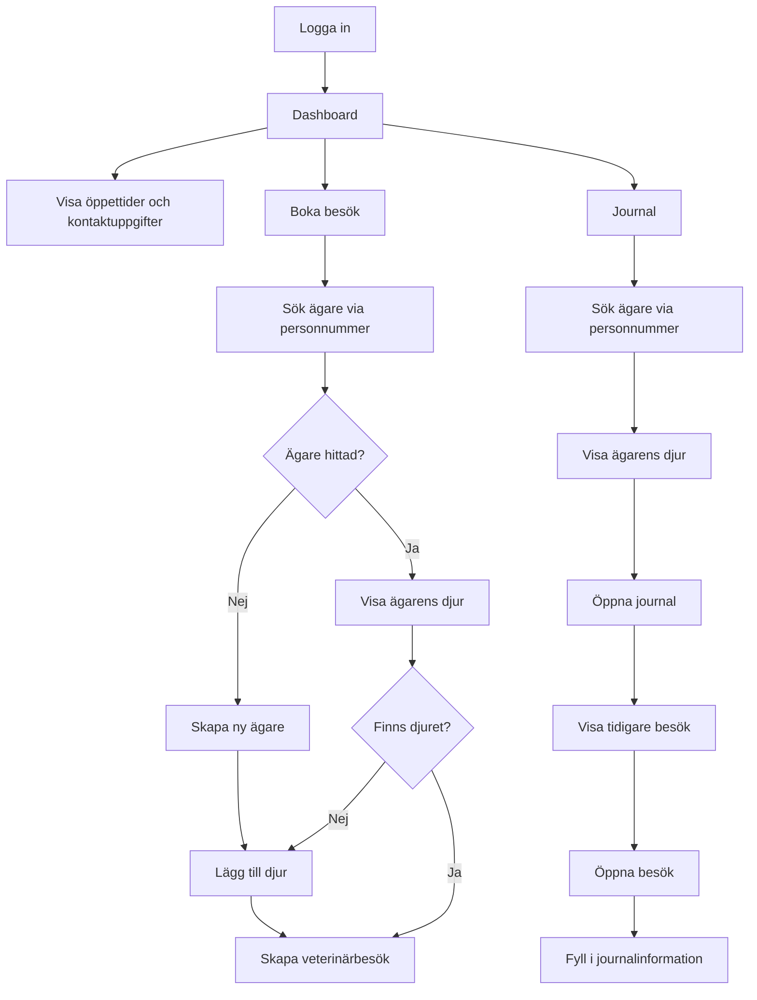

## Funktioner

### Implementerat i API

* Registrering av användare
* Inloggning med JWT-autentisering
* Hantering av djurägare (CRUD)
* Hantering av djur (CRUD)
* Hantering av veterinärbesök och journalinformation 
* Sökning av djurägare via personnummer

### Implementerat i Blazor-klienten

* Inloggning
* Sökning av djurägare
* Visning av djur kopplade till en djurägare
* Visning av journalhistorik
* Skapande av veterinärbesök
* Ändring av journalinformation

## Begränsningar

Projektet innehåller fler funktioner i API:t än vad som för närvarande exponeras i Blazor-klienten. Fokus har legat på att implementera kärnfunktionalitet samt integrationen mellan frontend och backend.

Rollbaserad behörighet är ännu inte implementerad fullt ut. ASP.NET Identity används för autentisering, men åtkomst baserad på användarroller har inte färdigställts.

Planerade roller är:

* Administratör
* Veterinär
* Djursjukvårdare
* Djurägare

I en framtida version kommer både API-endpoints och delar av användargränssnittet att begränsas utifrån användarens roll.

Av denna anledning finns det i dagsläget ingen funktion för registrering via Blazor-klienten. Tanken är att endast användare med rätt behörighet ska kunna skapa nya användarkonton.

## Starta projektet

### Förutsättningar

* .NET 9 SDK
* SQL Server
* Visual Studio 2022 eller senare

### Installation

1. Klona repot:

```bash
git clone <repository-url>
```

2. Uppdatera anslutningssträngen i `appsettings.json`.

3. Skapa databasen:

```bash
dotnet ef database update
```

4. Starta API-projektet.

5. Starta Blazor-klienten.

(OBS Nödvändig konfiguration för databaskopplingen finns inte med i repot)

### Inloggning

Användare kan registreras via API:t och därefter logga in via Blazor-klienten.

Frontenden är deployad via GitHub Pages. För att den deployade versionen ska fungera används:
<base href="/VeterinaryJournalSystem/" />
Om projektet körs lokalt kan den behöva ändras till:
<base href="/" />
beroende på hur projektet startas.


# Frontendflöde - Flödesdiagram




# VeterinaryJournalSystem - Klassdiagram

```mermaid
classDiagram
    class StaffUser {
        string Id
        string FullName
        string StaffCode
    }

    class Owner {
        string Id
        string FullName
        string PhoneNumber
        string PersonalNumber
        string Comment
    }

    class Pet {
        string Id
        string Name
        string Species
        string Breed
        DateTime DateOfBirth
        bool IsInsured
        string CurrentMedications
        string Allergies
        string OwnerId
    }

    class Visit {
        string Id
        DateTime ScheduledAt
        string ReasonForVisit
        string Symptoms
        string Examination
        string Diagnosis
        string Treatment
        string VeterinarianNotes
        VisitStatus Status
        string PetId
        string VeterinarianId
    }

    class VisitStatus {
        <<enumeration>>
        Scheduled
        InProgress
        Completed
        Cancelled
    }

    Owner "1" --> "*" Pet
    Pet "1" --> "*" Visit
    StaffUser "1" --> "*" Visit
    Visit --> VisitStatus
 ```
